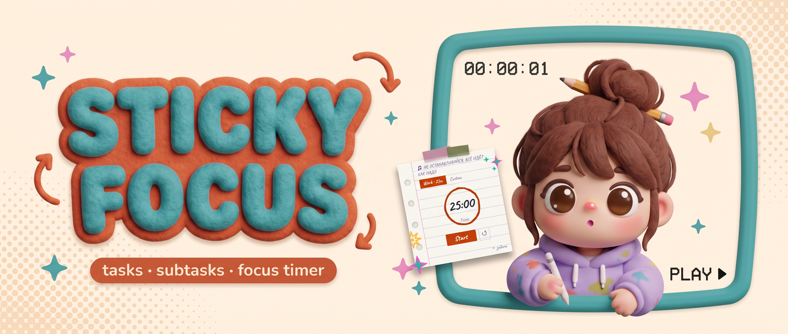
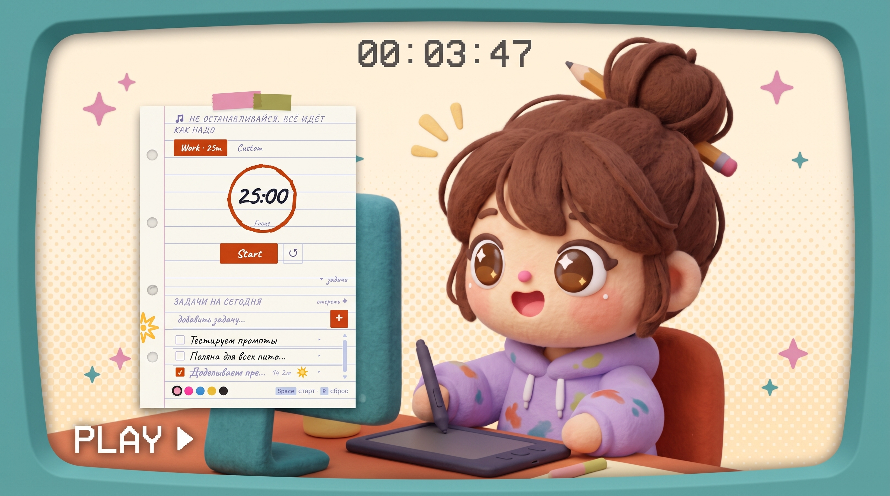
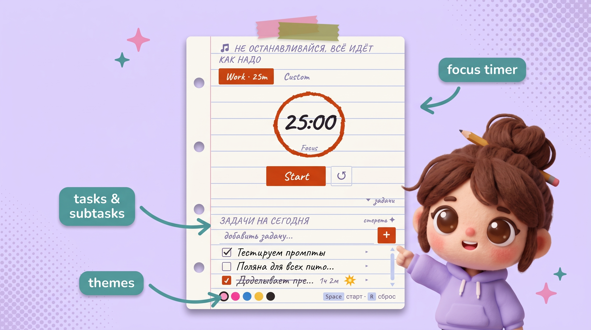

  

**Помодоро-таймер в виде стикера прямо на рабочем столе**

Всегда поверх всех окон · Бесплатно · Для Windows

](https://github.com/V1erahere/sticky-focus/releases/download/v1.0.0/Sticky-Focus-2.0.0.exe))

---

## Зачем это нужно

Открытые вкладки, уведомления, соцсети — всё это постоянно отвлекает.
Sticky Focus живёт поверх всего и не даёт забыть, над чем ты сейчас работаешь.

---

## Как это выглядит

Маленький стикер висит в углу экрана, пока ты работаешь — в браузере, в Photoshop.

---

## Что умеет

| Фича | Описание |
|------|----------|
| 📝 **Задачи и подзадачи** | Добавляй задачи и разбивай их на подпункты |
| ⏱️ **Помодоро-таймер** | Встроенный таймер фокуса прямо в стикере |
| 🕐 **Учёт времени по задаче** | Выбери задачу — таймер будет записывать время именно на неё, и ты всегда увидишь сколько часов потратила |
| 🎨 **Темы оформления** | Несколько цветовых тем на выбор |
| ✅ **Зачёркивание задач** | Отмечай выполненное — это приятно |
| 🔖 **Штампики за выполнение** | Заверши задачу и получи штампик прямо на стикер |
| 📌 **Поверх всех окон** | Стикер всегда виден, что бы ты ни делала |
| 🪟 **Компактный режим** | Сворачивается в маленький виджет |

---

Сделано с ♥ by [Vera Kashtanova](https://github.com/V1erahere)

